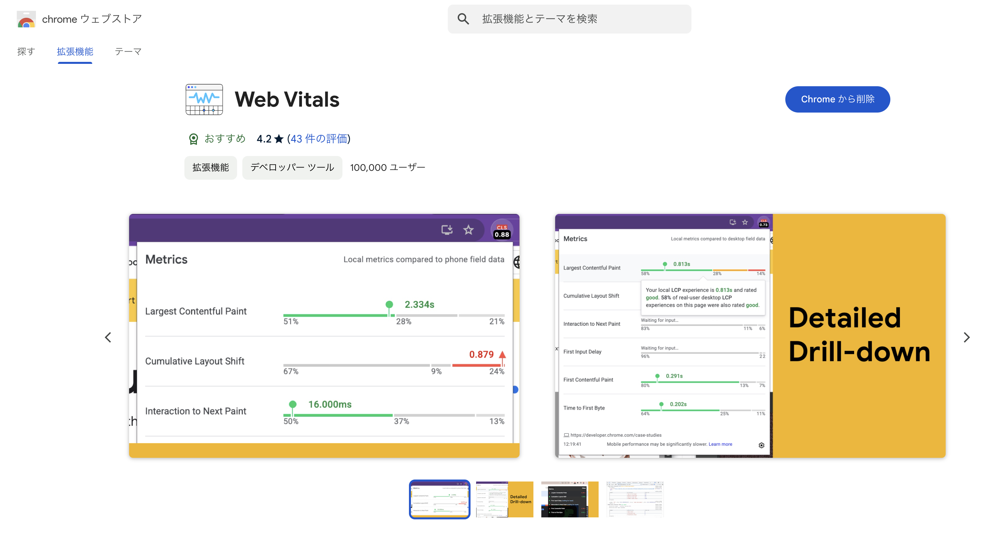
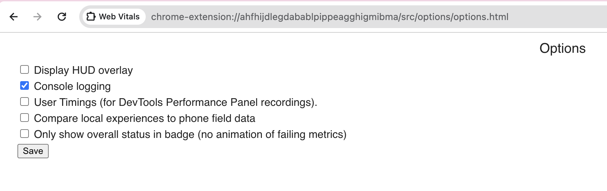
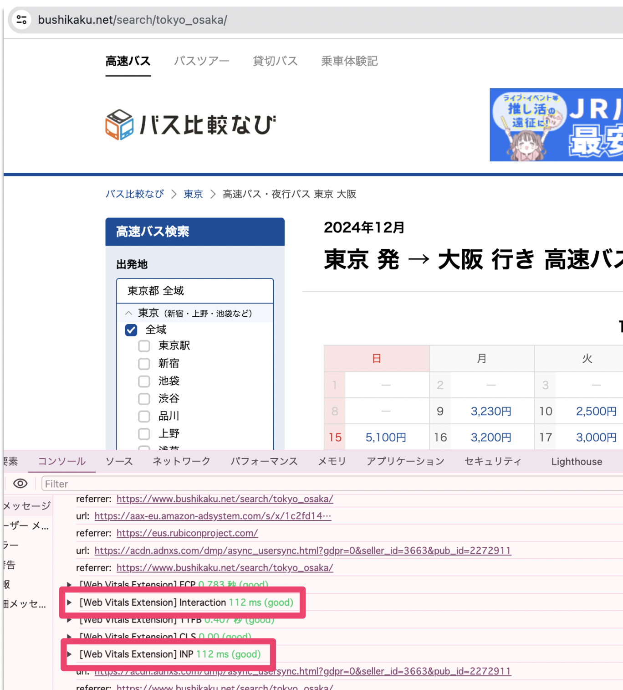
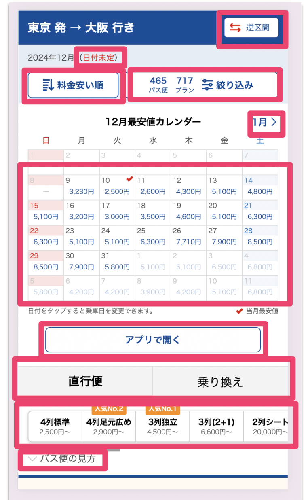

## はじめに

この記事では、**React** を使用したページの **INP（Interaction to Next Paint）** を改善するための具体的な方法を紹介します。

### INP とは？

**INP** は、ウェブサイトの応答性を測定する重要な指標です。以下のような操作時に、画面がどれだけ速く反応するかを数値化します：

- ボタンをクリックして商品を追加する
- メニューを開く
- フォームに入力する

**目安**：Google は「**200ms 以下**」を理想としています。

要するに、この数値が小さいほどユーザー体験が良好ということです。詳しくは[こちらの記事](https://zenn.dev/lclco/articles/13b051353bd7e3)を参考にしてください。

弊社が提供するサービス[バス比較なび](https://www.bushikaku.net/)では、かつて**8 万件**の INP 警告がありましたが、**1 万件**まで削減しました。本記事では、その際に行った手順や改善方法を共有します。

## 1. INP を計測する

改善の第一歩は、**問題箇所を特定するための計測**です。

本記事では、手元の環境で INP を計測する方法を説明します。以下の手順は Mac の Chrome 環境を想定しています。

### 手順

1. **Chrome プラグインの[Web Vitals](https://chromewebstore.google.com/detail/web-vitals/ahfhijdlegdabablpippeagghigmibma?hl=ja&pli=1)をインストールする**  
   

2. **Web Vitals のオプションで「Console logging」にチェックを入れる**  
   

3. **計測対象ページを開く**  
   例：[バス比較なび](https://www.bushikaku.net/search/tokyo_osaka/)を開きます。

4. **デベロッパーツールを開く**  
   `Option + Command + I` を押します。

5. **コンソールにログを確認する**  
   `[Web Vitals Extension] Interaction` や `[Web Vitals Extension] INP` といったログが表示されます。  
   ※ INP は、ページ内で一番重たい操作（Interaction）と考えれば OK です。

   

## 2. 問題箇所を特定する

計測ができたら、次は**どの操作が INP を悪化させているか**を特定します。

以下のような手順で調査を進めます：

1. 計測したい画面を開く。
2. ボタンやリンクなど、操作可能な要素をクリックする。
3. コンソールに出力された INP のスコアを確認する。

以下は例です。赤枠で囲った部分のボタンやリンクを順番に操作し、INP スコアが悪い箇所を探します。



## 3. 問題を解決する

INP が悪化している箇所を特定したら、次はそれを改善します。

### 具体例：バス比較なびでの改善

`バス比較なび` では、検索ページの **State 更新処理が重たい** ことが原因でした。そのため、以下の対応を行いました：

- `setState` を **`startTransition`** でラップして処理を非同期化

これにより、目に見えて INP スコアが改善しました。

### startTransition とは？

`startTransition` は React の機能の 1 つで、**状態更新を非同期化**するためのものです。これにより、画面の応答性を向上させることができます。

```javascript
import { startTransition } from "react";

startTransition(() => {
  setState(newState);
});
```

このように startTransition を活用することで、インタラクションの速度を大幅に改善できます。

## まとめ

この記事では、**INP スコアを改善するための実践的な方法**を紹介しました：

1. **Web Vitals プラグインで INP を計測**
2. **問題箇所を特定**
3. **`startTransition` を用いた改善**

実際に `バス比較なび` では、これらの手法を用いることで **8 万件**の警告を **1 万件**まで削減しました。

この記事が、パフォーマンス改善の一助となれば幸いです！
